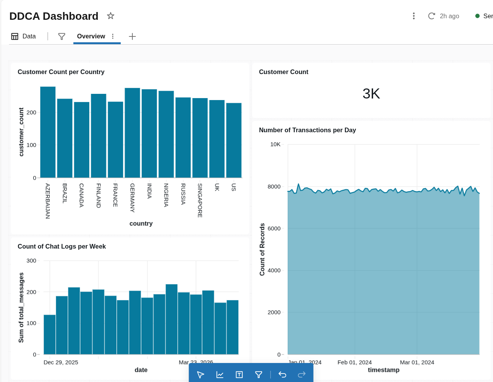
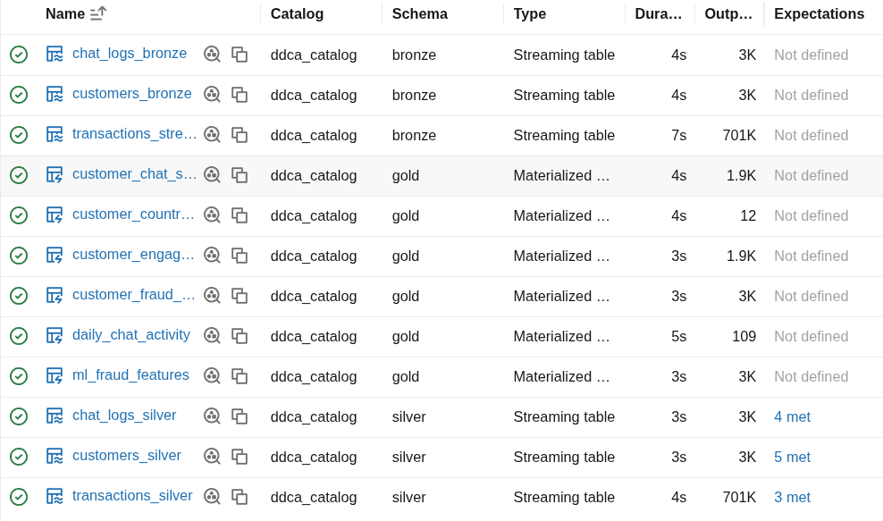
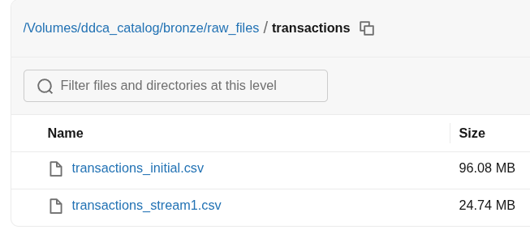
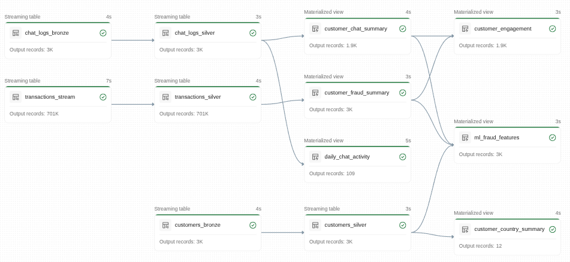
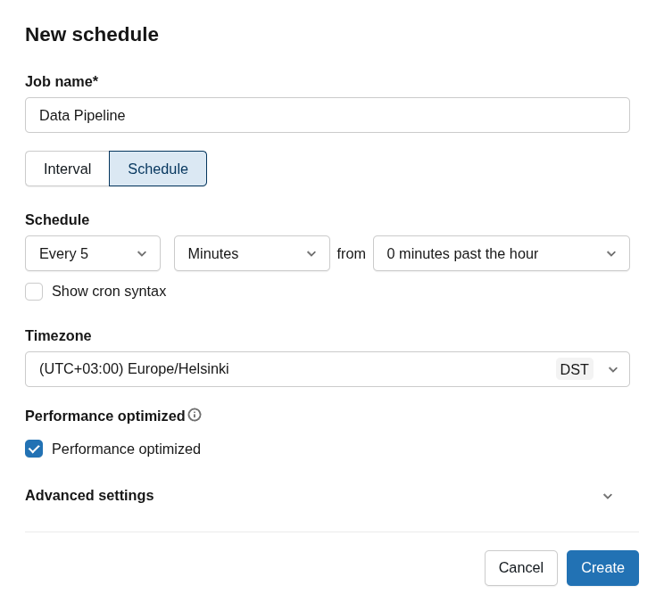
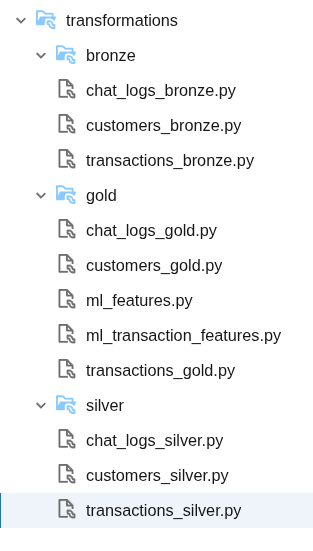

# Examples

This folder shows that the pipeline is working end-to-end.

---

## Dashboard

The dashboard shows some basic insights:
- customer count per country  
- total number of customers  
- number of chat logs per week  
- number of transactions per day  

This helps us quickly understand the data.

---

## Generated Tables

This image shows the list of tables created in Databricks.

All tables (bronze, silver, gold) are created successfully, which means the pipeline is working correctly.

---

## Data Ingestion (Batch Simulation)

Here we upload dataset files in batches to simulate streaming.

Example:
- `transactions_initial.csv` (first load)  
- `transactions_stream1.csv` (next batch)  

These are uploaded to:
- `bronze/raw_files/`

This shows how new data can arrive and be processed step by step.

---

## Pipeline Overview

This is a Databricks pipeline diagram.

It shows:
- how tables are connected  
- which tables depend on others  
- overall data flow (bronze → silver → gold)  

---

## Pipeline Scheduling

Here we can see the pipeline schedule.

The pipeline can run automatically at set times.  
This helps simulate a real system where new data is processed continuously.

---

## Pipeline Structure in Databricks

This shows the folder and file structure inside Databricks.

You can see:
- bronze, silver, gold folders  
- pipeline scripts  

This confirms that the project is organized properly.
